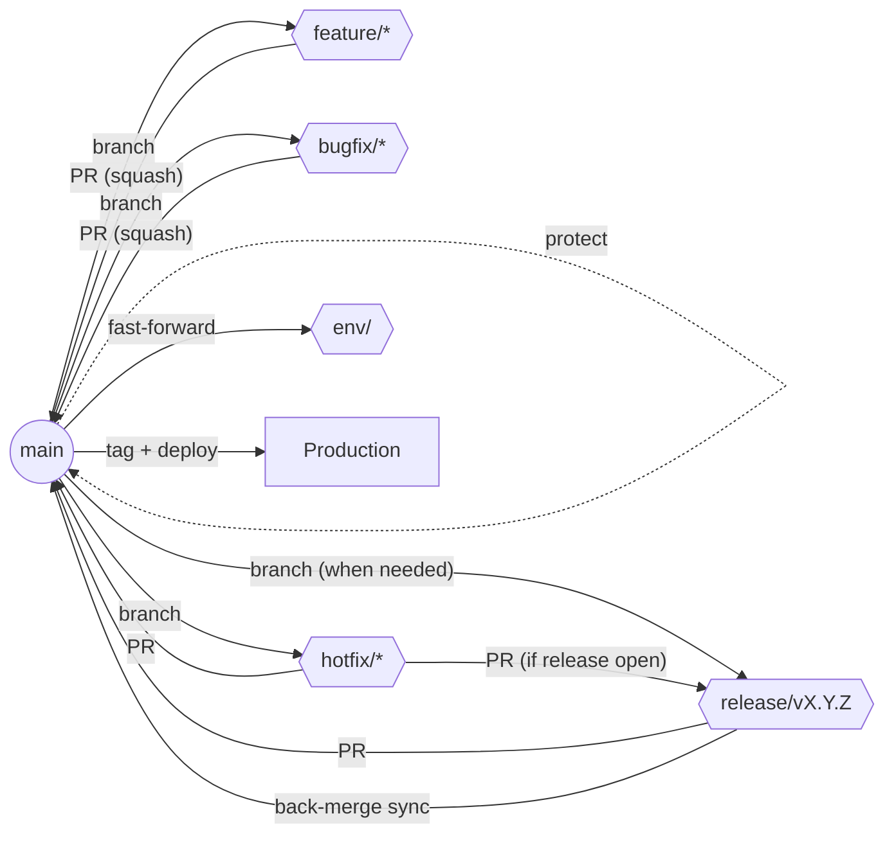

# cherry application branching strategy

This document defines the production-ready branching model for the cherry Flutter application. It provides explicit branch definitions, workflows, and governance so contributors can ship safely, respond rapidly to incidents, and automate CI/CD with confidence.

---

## 1. Branch Topology and Flow



`main` is the only long-lived development line. All other branches are short lived, created from `main`, and merged back through reviewed pull requests with automated checks.

---

## 2. Branch Definitions

| Branch Type | Purpose | Created From | Primary Merge Target(s) | Naming Convention | Lifecycle & Notes |
|-------------|---------|--------------|--------------------------|-------------------|-------------------|
| **`main`** | Always releasable production source of truth. | — | — | `main` | Protected branch. Only updated via reviewed PRs. Every successful deployment is tagged from `main`. |
| **Feature** | New functionality, enhancements, experiments. | `main` | `main` | `feature/<short-topic>` | Short lived (ideally < 5 days). Rebase/merge `main` frequently. Squash merge back into `main`. |
| **Bugfix** | Non-urgent bug fixes found in development or QA. | `main` | `main` | `bugfix/<short-topic>` | Treated the same as feature branches but scoped to defects. Squash merge into `main`. |
| **Hotfix** | Critical production incident requiring immediate remediation. | `main` | `main` **and** active `release/*` (if present) | `hotfix/<short-topic>` | High-priority workflow. Merge via PR into `main`, tag & deploy, then cherry-pick into active release branch. |
| **Release** *(optional)* | Freeze scope to stabilise a numbered release while new work continues on `main`. | `main` | `main` | `release/v<major>.<minor>.<patch>` | Exists only for the duration of the release. Allow QA-only fixes. Merge back into `main` and delete after tagging. |
| **Environment** *(optional)* | Mirror of `main` for long-lived non-production environments (staging, demo). | `main` | Fast-forward from `main` | `env/<environment>` | Updated automatically from latest `main` tag. No direct commits. |
| **Backend** (Optional: used as a temporary code split for frontend flutter and backend Node.) | Used to temporarily split code between flutter/ dart and Node.JS before being merged to main | Main / Itself | Pretty much just Main 😅 | 'Backend' | Used primarily to split the code languages and issues for more simplicity and manageability, but all backend code will be merged to main regardless, eventually.

---

## 3. Decision Matrix

| Situation | Branch Type | Why |
|-----------|-------------|-----|
| Building a new UI or feature flag | `feature/<topic>` | Keeps scope isolated and history concise. |
| Fixing a regression uncovered in QA before release | `bugfix/<topic>` | Aligns with standard review flow while signalling priority. |
| Urgent production outage, security fix, or data-loss issue | `hotfix/<topic>` | Enables rapid remediation directly from `main` with immediate deployment. |
| Preparing a release that needs a QA freeze or marketing coordination | `release/vX.Y.Z` | Allows final polish while ongoing work continues on `main`. |
| Maintaining a staging or demo environment that must temporarily diverge | `env/<environment>` | Provides an automation-only mirror of `main` without fragmenting development. |
| Routine maintenance, refactors, dependency bumps | `feature/<topic>` or `bugfix/<topic>` | Follow normal PR process unless the work is an emergency hotfix. |

---

## 4. Branch Workflows

### 4.1 Feature & Bugfix Branches

1. Update local `main`:
   ```bash
   git checkout main
   git pull origin main
   ```
2. Create a branch:
   ```bash
   git checkout -b feature/<short-topic>
   # or git checkout -b bugfix/<short-topic>
   ```
3. Implement changes with focused commits.
4. Keep the branch current at least daily:
   ```bash
   git fetch origin
   git rebase origin/main   # or merge if collaboration requires
   ```
5. Push for review:
   ```bash
   git push -u origin feature/<short-topic>
   ```
6. Open a PR to `main` (see Section 5) and address feedback.
7. Once approved and CI passes, squash merge via the PR interface.
8. Delete the branch locally and remotely.

### 4.2 Release Branches

1. Confirm `main` is green (all CI passing) and version scope is agreed.
2. Cut the branch:
   ```bash
   git checkout main
   git pull origin main
   git checkout -b release/v<major>.<minor>.<patch>
   git push -u origin release/v<major>.<minor>.<patch>
   ```
3. Apply only release-scoped changes (version bump, changelog, localisation, QA fixes).
4. Run the QA gate (Section 6).
5. Open a PR from `release/v…` to `main`.
6. Merge using **merge commit** or **fast-forward** (do not squash) to preserve release history.
7. Tag `main` after merge:
   ```bash
   git checkout main
   git pull origin main
   git tag v<major>.<minor>.<patch>
   git push origin v<major>.<minor>.<patch>
   ```
8. Trigger deployments, then delete the release branch.

### 4.3 Hotfix Branches

1. Stabilise `main` locally:
   ```bash
   git checkout main
   git pull origin main
   ```
2. Create the hotfix branch:
   ```bash
   git checkout -b hotfix/<incident-key>
   ```
3. Implement the minimal fix and add regression tests when feasible.
4. Push and open a PR targeting `main`. Flag reviewers and label as `hotfix`.
5. If a release branch is active, open a parallel PR from the same hotfix branch into `release/v…` after `main` is updated, or cherry-pick the merged commit.
6. Merge as soon as review and CI succeed (merge commit acceptable for multi-commit fixes).
7. Tag and deploy immediately from the updated `main` branch:
   ```bash
   git checkout main
   git pull origin main
   git tag v<major>.<minor>.<patch>
   git push origin v<major>.<minor>.<patch>
   ```
8. Document the incident and close the branch.

### 4.4 Environment Branch Sync (Optional)

Automation only—no direct commits.

```bash
git checkout env/<environment>
git fetch origin
git reset --hard origin/main
git push origin env/<environment> --force-with-lease
```

Schedule this in CI to run after each tagged release if the environment must mirror production.

---

## 5. Pull Request Requirements

### 5.1 Checklist (include in PR description)

- [ ] Target branch is correct (`main` or active `release/v…`)
- [ ] Linked issue, ticket, or incident reference
- [ ] Summary of changes and user impact
- [ ] Tests added/updated or rationale for omission
- [ ] `flutter analyze` and `flutter test` executed locally (attach output for complex changes)
- [ ] Screenshots or screen recordings for UI updates
- [ ] Documentation or configuration updates included if behaviour changed
- [ ] Rollback/feature-flag plan noted if applicable

### 5.2 Review Criteria

- At least one reviewer with domain knowledge must approve.
- Reviewers verify: code quality, adherence to architecture, test coverage, accessibility, performance concerns, and localisation impact.
- Requested changes must be addressed before merging; mark conversations as resolved.

### 5.3 Merge Strategies

| Branch Type | Merge Method | Rationale |
|-------------|--------------|-----------|
| Feature/Bugfix | Squash merge | Produces a clean linear history and simplifies rollback. |
| Hotfix | Squash if single commit; otherwise merge commit to preserve incident trail. |
| Release | Merge commit or fast-forward | Maintains visibility into release QA activity. |
| Environment | Force fast-forward from `main` | Prevents divergence and eliminates manual edits. |

Branch protection must enforce these merge options through repository settings.

---

## 6. QA Gates and Deployment Procedures

### 6.1 Pre-Merge QA (All PRs)

1. Automated checks succeed (`flutter analyze`, `flutter test`, formatting, Firebase lint, security scanners).
2. Reviewer confirms manual testing evidence for UI or platform-specific changes.
3. Ensure feature flags or configuration toggles default to safe values.

### 6.2 Release Branch QA

1. Smoke test on target devices (iOS, Android, Web where applicable).
2. Validate analytics and crash reporting integrations.
3. Run accessibility checks (color contrast, screen reader) for major UI features.
4. Verify Firebase security rules and cloud functions for relevant changes.
5. Update changelog and release notes.

### 6.3 Deployment Pipeline

1. After merging into `main`, create and push the semantic version tag.
2. CI pipeline builds signed artifacts (Android App Bundle, iOS IPA, web bundle) using the tagged commit.
3. Automated deployment jobs publish to Play Console, App Store Connect, Firebase Hosting, and other environments as configured.
4. Post-deploy verification: monitor metrics, run smoke tests, and confirm feature flags.
5. Record deployment summary in the release tracking document.

---

## 7. Conflict Resolution Procedures

1. **Stay Current:** Rebase or merge `main` into your branch daily to minimise drift.
2. **Resolve Locally:** When conflicts arise, resolve them locally while maintaining logical commits. Re-run tests before pushing.
3. **Interactive Rebase for Cleanup:** Use `git rebase -i` to tidy commits before opening the PR if conflict resolution introduced noise.
4. **Pair on Complex Conflicts:** If the conflict spans multiple domains, coordinate with the code owners to pair through the resolution.
5. **Document Resolution:** Summarise significant conflict resolutions in the PR to aid reviewers.
6. **Escalation:** If a conflict blocks the team (e.g., hotfix vs. release), notify the tech lead in Slack, prioritise the hotfix, and sequence merges accordingly.

---

## 8. CI/CD Integration Requirements

- **Required Checks:** Configure the repository to require passing results for `flutter analyze`, `flutter test`, formatting (e.g., `dart format --output=none --set-exit-if-changed .`), Firebase security rule tests, and any integration tests defined under `test/`.
- **Branch Protection:** Enable required status checks and reviewer approvals on `main` (and on any temporary `release/*` branches during their lifetime). Block force pushes and direct commits.
- **Automation Hooks:**
  - Trigger CI for every PR and on pushes to `main` and `release/*`.
  - Trigger release build pipelines when a tag matching `v*.*.*` is pushed.
  - Automatically sync optional `env/*` branches after successful deployments.
- **Secrets Management:** Store API keys, signing certificates, and Firebase tokens in the CI secret store. Never commit them to branches.
- **Observability:** Integrate deployment notifications with Slack or Teams and log release metadata to maintain traceability.

---

## 9. Continuous Improvement

- Review this strategy quarterly to confirm it still meets team size, cadence, and tooling needs.
- Capture lessons from each release or incident and update relevant sections (decision matrix, QA gates, CI requirements).
- Keep diagrams and examples aligned with current practice so onboarding remains effortless.

---

## 10. Seed Branch Inventory (as of this revision)

| Branch Name | Type | Notes |
|-------------|------|-------|
| `main` | Permanent | Canonical development and release branch created from the prior `work` head. |
| `feature/template-inventory` | Feature | Example scaffold following the naming convention for new feature work. |
| `bugfix/template-validation` | Bugfix | Example scaffold to demonstrate defect branch naming. |
| `hotfix/template-critical` | Hotfix | Placeholder for emergency production fixes with expedited workflow. |
| `release/v0.1.0` | Release | Seed release branch showing semantic version naming for stabilisation periods. |
| `env/staging` | Environment | Illustrative environment mirror ready for automation-based syncs. |

By following this playbook, cherry contributors share a single, unambiguous branching model that supports rapid iteration, predictable releases, and reliable automation.
